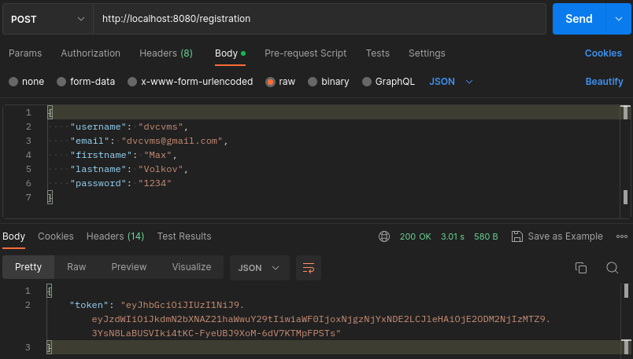
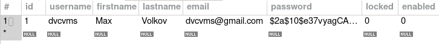
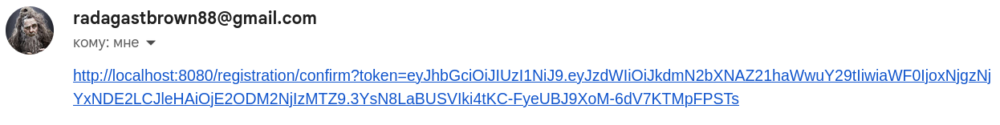
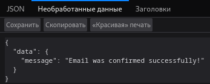
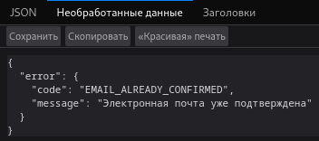
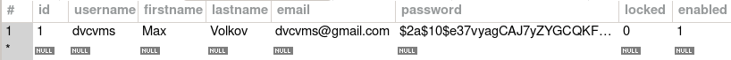
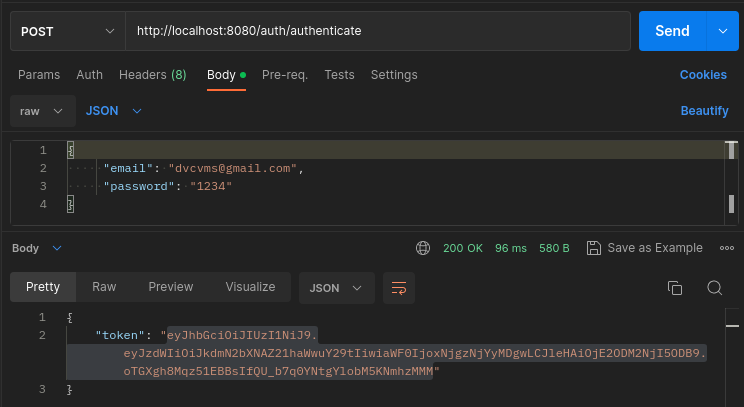
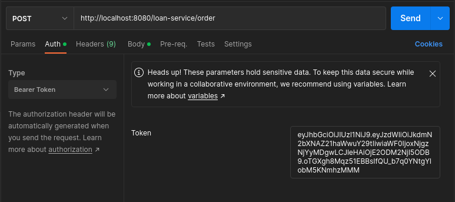
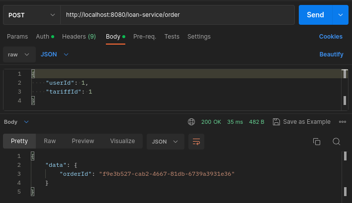
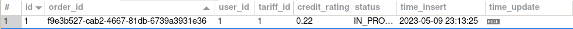

# About Me

Hi!

I'm a Java backend developer.

Author - [Max Volkov](https://github.com/dvcvms)

My telegram: [@dvcvms](https://t.me/dvcvms)  
My email: dvcvms@gmail.com  
My CV: [link](https://drive.google.com/drive/folders/1KBKpWRn6xVJ4qnieDHj1ZdPkLpuxLJQX?usp=share_link)

### Let's take a look at my service!

# Credit Helper

Credit Helper is a service that assists in applying for a loan. Our platform provides information about current rates
and conditions, and allows users to track their application status. Users also have the option to cancel their loan
application. Approval or rejection of loan applications is determined randomly. Compare and choose the best options for
yourself!

We understand that it is important for your data to be protected, so we take a number of measures to ensure security,
including registration with email verification, password encryption, and authentication via JWT token. We strive to make
your experience with us as secure and convenient as possible.

## Features

- [x] User registration with email verification
- [x] Authentication with JSON Web Token (JWT)
- [x] Role-based authorization
- [x] Password encryption using BCrypt
- [x] Email sending mechanism
- [x] Migrating with Liquibase

## Technologies

- [x] Java 20
- [x] Spring Boot 3
- [x] Spring Security 6
- [x] JSON Web Token (JWT)
- [x] BCrypt
- [x] Spring JavaMail API
- [x] Email verification with expiry
- [x] Liquibase
- [x] JdbcTemplate
- [x] MySQL
- [x] SQL
- [x] Exception Handler
- [x] Scheduler
- [x] Maven

## To build and run this project follow these steps:

### Clone the repository:

```
  https://gitlab.com/dvcvms/credit-registration.git
```

### Navigate to the project directory:

```
  cd credit-registration
```

### You need to set your database settings in application.yml:

```
spring:
  datasource:
    driver-class-name:
    url:
    username:
    password:
```

#### (!) Don`t forget add database driver into pom.xml

### Another way you can use these properties. Replace database settings with these:

```
spring:
  datasource:
    driver-class-name: org.h2.Driver
    url: jdbc:h2:file:./credit_helper_db
    username: sa
    password: password
```

### Build the project:

```
  mvn clean install
```

### Run the project:

```
  mvn spring-boot:run
```

## Another application properties

### Actually you can change these properties to change working of scheduled Job service:

```
  scheduler:
    initDelay: 120000
    fixedRate: 120000
    poolSize: 5
```

### Also you must set properties for email sender mechanism:

```
  email:
    port:
    host:
    login:
    password:
```

### Another way you can use these properties. Replace email setting with these:

```
  email:
    port: 587
    host: smtp.gmail.com
    login: radagastbrown88@gmail.com
    password: nkttqoskdfudlsab
```

## FAQ

#### How to set app password for email?

You can use Google Mail. For the password, you need to use an app password. Here is a manual for app
password - [link](https://support.google.com/mail/answer/185833?hl=en-GB).

## How my service is working? Look at it!

### First of all user should register and auth

#### Registration:



#### Your registration request is accepted into database but not enabled:



#### For your email sent verification link. Click on the link and you will be activated:



#### Email was confirmed successfully:



#### If you click again you will see:



#### After that you became activated in the database:



#### Auth and get token:



### Now you can use service

#### Set this token into Bearer Token for your requests:



#### Creating order:



#### Order added into database:



## Running Tests

To run tests, run the following command

```
  maven clean test
```

## Feedback

If you have any feedback, please reach out to me at dvcvms@gmail.com or telegram - [@dvcvms](https://t.me/dvcvms)  

